# Evidencia - Pruebas de Carga con Locust y Docker
Creamos cuenta en docker Hub

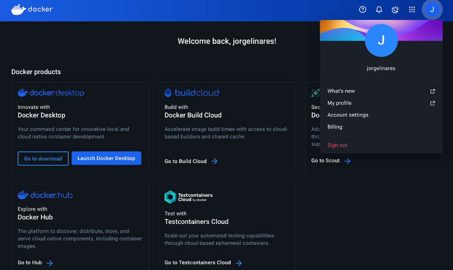

## 1. Ejecución del Docker Compose

Se ejecuta el Docker Compose y se genera la imagen y contenedor del API de inferencia.

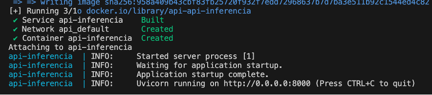

## 2. Subida de la Imagen a DockerHub

Con la imagen ya generada:

1. Nos autenticamos en Docker Hub desde el proyecto.

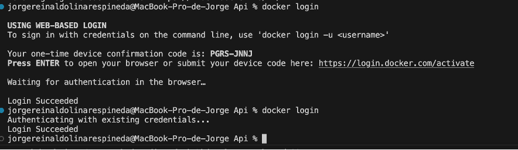

2. Subimos la imagen del API de inferencia a DockerHub.

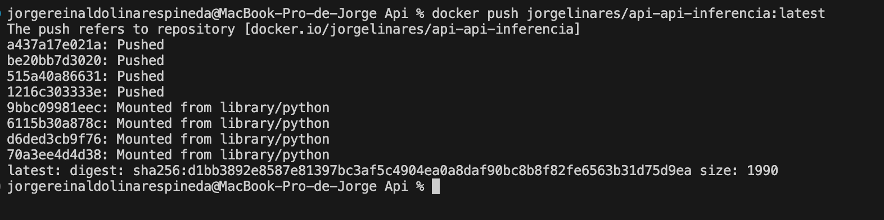

> ✅ Desde DockerHub, se puede visualizar la imagen cargada correctamente.

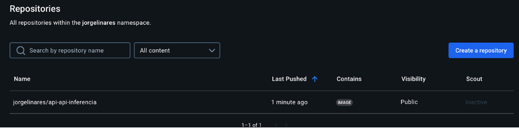

## 3. Uso de la Imagen desde DockerHub

Generamos un nuevo Docker Compose con la imagen previamente cargada y lo ejecutamos, llamando directamente la imagen de Docker Hub.

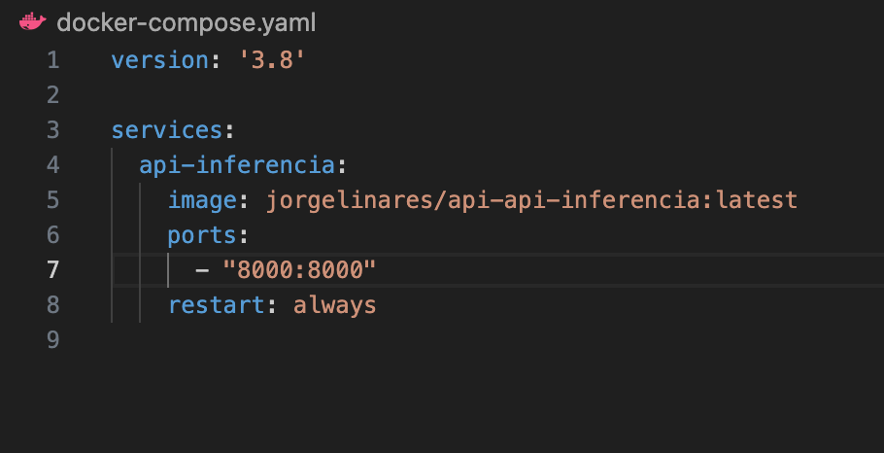

## 4. Configuración de Locust

Luego configuramos Locust para realizar las pruebas de carga.

## 5. Asignación de Recursos al Contenedor

En el `docker-compose.yml`, se asignan los siguientes recursos al contenedor:

```yaml
resources:
  limits:
    cpus: '0.50'       # Máximo medio núcleo de CPU
    memory: 512M       # Máximo 512MB de RAM
  reservations:
    cpus: '0.25'       # Sugerencia de 1/4 de núcleo
    memory: 256M       # Sugerencia de 256MB de RAM
```

Luego, ejecutamos el contenedor.

## 6. Resultados de la Prueba

En las gráficas resultantes, se observa que las peticiones se incrementan hasta **10.000 usuarios**, y las gráficas se mantienen respondiendo correctamente.

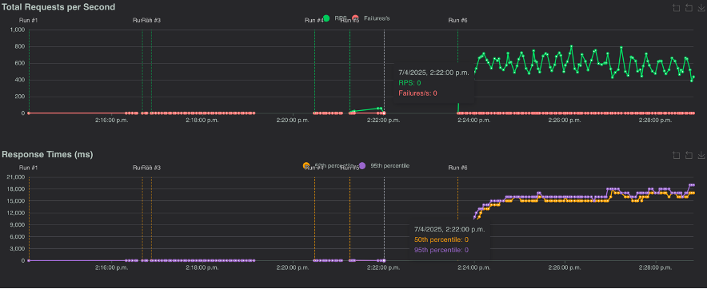
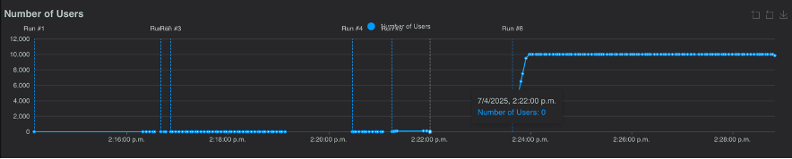


## 7. Prueba con Menores Recursos

Realizamos una nueva configuración con menos recursos, ya que la anterior fue exitosa:

```yaml
resources:
  limits:
    cpus: '0.25'       # Máximo un cuarto núcleo de CPU
    memory: 256M       # Máximo 256MB de RAM
  reservations:
    cpus: '0.125'      # Sugerencia de 1/8 de núcleo
    memory: 128M       # Sugerencia de 128MB de RAM
```

Al ejecutar, observamos en la gráfica que hubo un **5% de fallas**, por lo cual se debe ajustar la asignación de recursos.

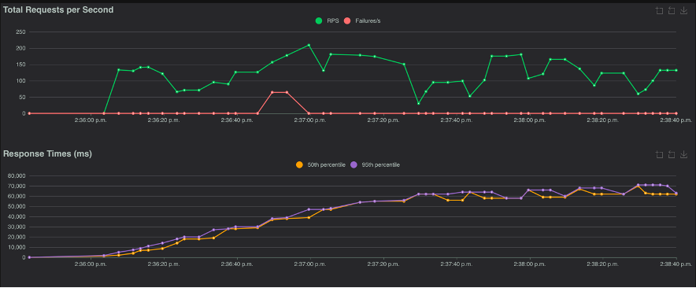
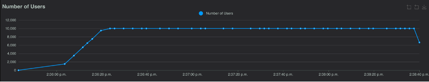

## 8. Configuración Óptima Final

Se modifica nuevamente la asignación de recursos con los siguientes valores:

```yaml
deploy:
  resources:
    limits:
      cpus: '0.25'       # Máximo un cuarto núcleo de CPU
      memory: 256M       # Máximo 256MB de RAM
    reservations:
      cpus: '0.25'       # Sugerencia de 1/4 de núcleo
      memory: 256M       # Sugerencia de 256MB de RAM
```

Luego, se vuelve a ejecutar.

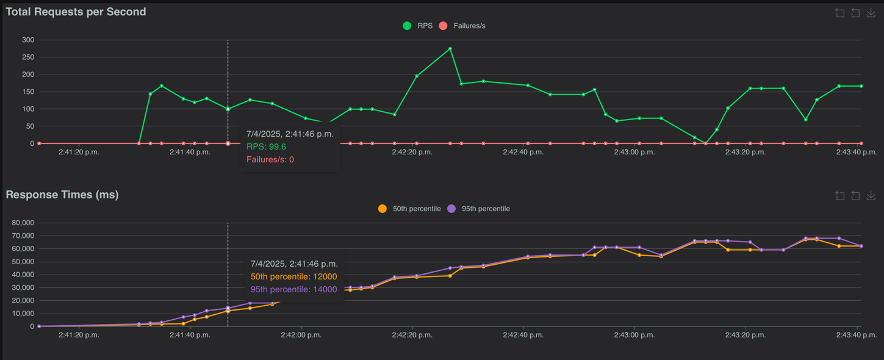
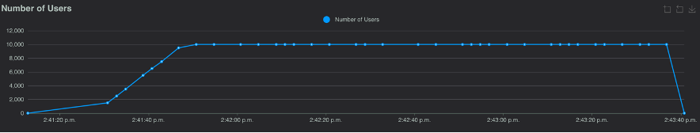

## 9. Conclusiones

Esta última configuración permite que el servicio funcione de manera óptima con **10.000 usuarios**, incrementando de a 500 y luego manteniéndose.
